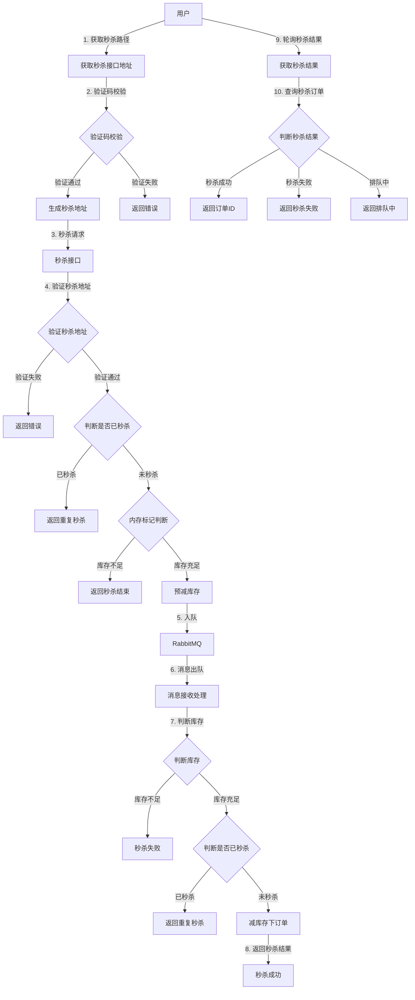
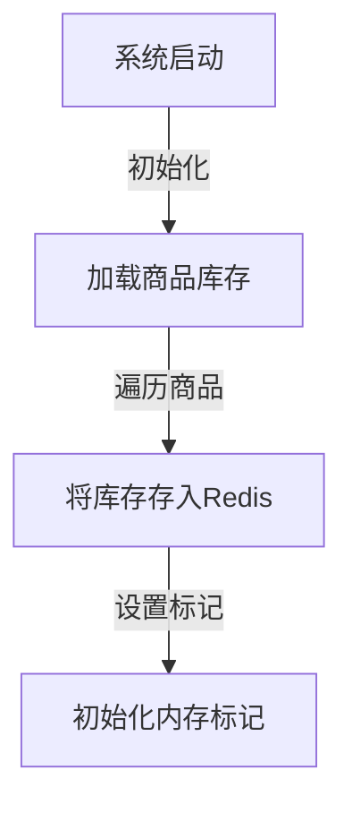
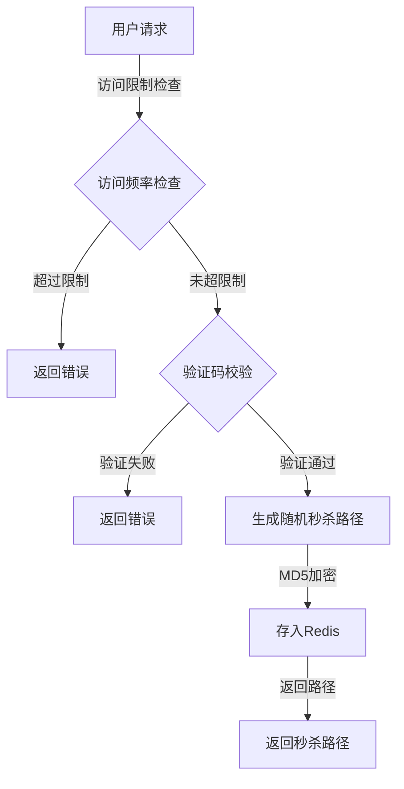
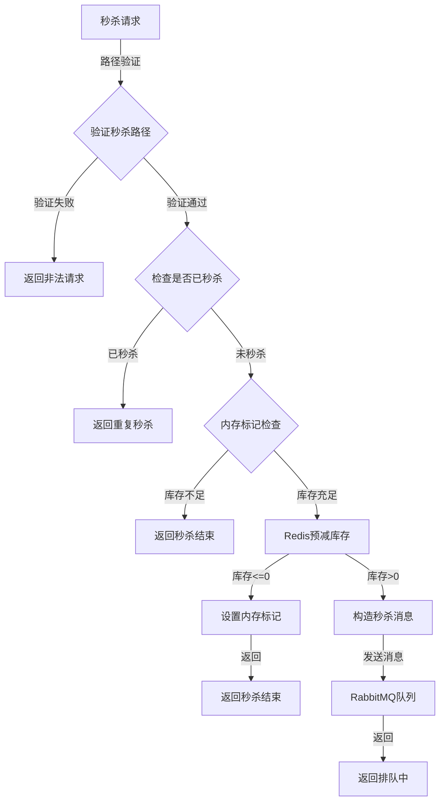
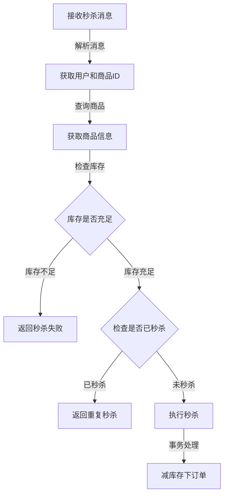
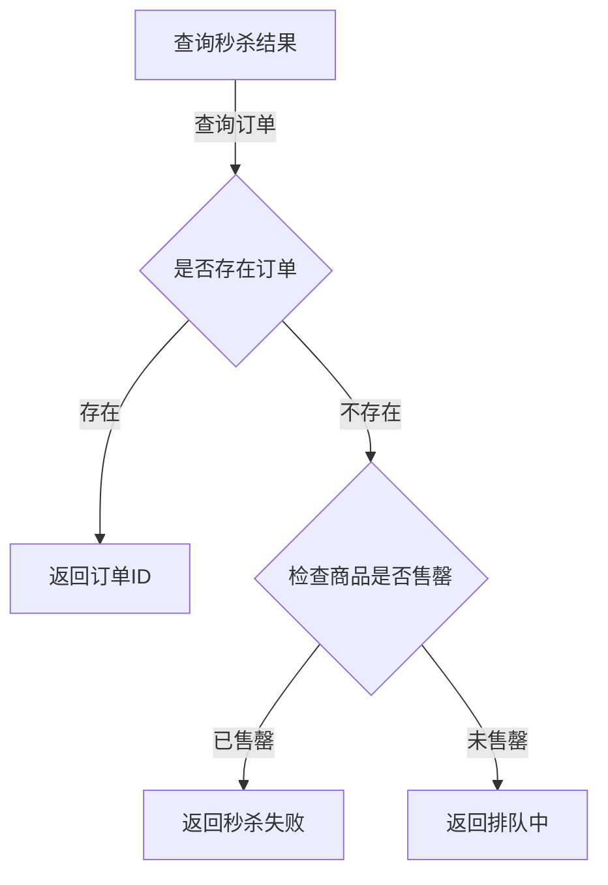

# 秒杀功能流程图

## 秒杀系统整体流程

## 秒杀系统核心组件

### 1. 系统初始化

### 2. 秒杀接口地址获取流程

### 3. 秒杀请求处理流程

### 4. 消息队列处理流程

### 5. 秒杀结果查询流程

## 秒杀系统优化策略

1. **接口限流防刷**：使用AccessLimit注解限制接口访问频率
2. **内存标记**：使用localOverMap内存标记减少Redis访问
3. **Redis预减库存**：减少数据库访问压力
4. **RabbitMQ异步处理**：将秒杀请求异步化，提高系统吞吐量
5. **验证码机制**：防止机器人攻击，削峰填谷
6. **秒杀地址隐藏**：动态生成秒杀地址，防止接口被提前刷
7. **Redis缓存**：大量使用Redis缓存减轻数据库压力